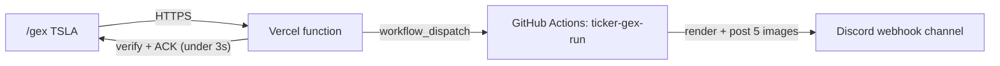

# DealerFlow

Free, deterministic **dealer-positioning** toolkit for options day-trading. One
Black-Scholes gamma / vanna / charm methodology — vendored independently into each tool, fed
by real exchange greeks / OI / IV from the free CBOE delayed-quotes feed (with a `yfinance`
fallback) — surfaced **three ways**, all posting to Discord. **No LLM; every step is
deterministic.**

| Tool | What it does | Cadence | Lives in |
| --- | --- | --- | --- |
| **Screener** | Scans a watchlist and ranks contracts on a 0–100 dealer-positioning + 8/21-EMA price-action score, posting 2 high-conviction picks, a candidates table, and per-pick heatmaps | Twice daily (close + morning) | [`src/`](src/) |
| **SPY hourly dealerflow** | Posts SPY gamma/vanna/charm heatmaps (5 images) — the gamma flip and call/put walls across the front of the curve | Hourly, market hours | [`spy_gex/`](spy_gex/) |
| **On-demand `/gex <ticker>`** | Type `/gex TSLA` in Discord and get the same 5-image dealerflow for **any** ticker | On demand | [`ticker_gex/`](ticker_gex/) + [`discord-endpoint/`](discord-endpoint/) |

The three tools share the same exposure math but are **independent** — run any subset. The
screener is the flagship and most of this README covers it; the two dealerflow surfaces have
their own deep-dive READMEs linked above.

> ⚠️ **Not financial advice.** See the [Disclaimer](#disclaimer). Released under the [MIT License](LICENSE).

**This README has two parts:**

- [👤 **For Humans**](#-for-humans) — what each tool does, the math, setup, scheduling, and configuration.
- [🤖 **For Agents**](#-for-agents) — a dense map of the repo for AI coding agents and contributors: file responsibilities, the data-flow pipeline, key function contracts, and invariants you must not break.

---

# 👤 For Humans

**Most of this section documents the screener** (the flagship twice-daily scan). The two
heatmap surfaces have their own short sections lower down —
[SPY hourly dealerflow](#spy-hourly-dealerflow) and
[On-demand `/gex` (any ticker)](#on-demand-gex-any-ticker) — plus deep-dive READMEs in their
folders.

## How it works

| Run | Schedule (ET) | Command |
| --- | --- | --- |
| Close | Mon–Fri 4:05 PM | `python -m src.daily_options_agent --mode=close` |
| Morning | Mon–Fri 9:10 AM | `python -m src.daily_options_agent --mode=morning` |

Pipeline: pull option chains (CBOE → yfinance fallback) → compute per-contract
Black-Scholes **gamma, vanna and charm** and aggregate them into dealer-signed exposure
grids (GEX / VEX / CEX) → derive key levels (gamma flip, vanna flip, call/put walls) →
score each contract → select trades → render heatmaps → post to Discord.

### Dealer-positioning math

Greeks are computed analytically (normal pdf/cdf via `math.erf`, **no scipy**) and verified
against finite-difference of the Black-Scholes delta to ~1e-8:

- **GEX** = γ·OI·100·S²·sign·0.01 — dealer-delta $ shift per **1% spot move**.
- **VEX** = vanna·OI·100·S·sign·0.01 — dealer-delta $ shift per **1 vol-point** of IV.
- **CEX** = charm·OI·100·S·sign / 365.25 — dealer-delta $ shift per **calendar day**.

Dealer sign is +1 for calls, −1 for puts (long-calls / short-puts convention, so positive
net GEX ⇒ stabilising regime). The **flip** levels are the strikes where cumulative
exposure crosses zero, searched within ±25% of spot so deep-OTM noise on 0–2 DTE chains
can't drag the flip into the wings. Net **vanna** sign drives the strategy guidance:
positive net vanna means an IV drop forces dealer **buying** (price support); negative
means dealer selling.

### Scoring

Each contract gets a 0–100 composite from five **continuous** components — GEX regime
**conviction** (`tanh` of the *magnitude* of the net dealer-gamma balance, so a strongly
one-sided book scores high whether it's positive-γ *or* negative-γ — a muddy neutral book
is the low-information case), order-flow (smooth vol/OI saturation), liquidity (log-OI),
vanna/charm concentration at the strike, and expected-move-scaled moneyness — so liquid
names spread across the range instead of piling onto one plateau. The dominant weighted
component is surfaced as the pick's **Edge**.

**Four directional dealer-flow overlays** sit on top of that (otherwise side-symmetric)
base score, because gamma/vanna/charm magnitudes are nearly identical for a call and a put
on the same strike — without a directional read the call-vs-put choice is barely better
than a coin flip. Each returns signed points (+ confirms the side, − opposes it, 0 neutral):

- **Dealer structure (GEX).** The structural read adapts to the regime. In a *positive-gamma*
  (mean-reverting) book the gamma flip is real support and the walls are real magnets, so a
  call sitting above the flip with room up to the call wall is confirmed (and a put below the
  flip with room to the put wall); chasing *past* a wall or fighting the flip is penalised;
  sitting *at* a wall or in the flip's reclaim zone is neutral. In a *negative-gamma*
  (trending) book dealers chase price, so we trade momentum **continuation** around the flip
  pivot — above the flip confirms calls and opposes puts, below the flip confirms puts and
  opposes calls (breaking a wall accelerates rather than caps, so walls don't veto). This
  never fades a breakout, and it gives put/breakdown setups the same structural confirmation
  calls get. Bands scale with the expected move. Toggle via `enable_gex_directional_filter`.
- **Net vanna sign (positive-γ books only).** The *direction* of the dealer hedge already
  printed as the vanna regime, now scored — but only where its assumption holds. Vanna's
  hedge flow is `F = −VEX·Δσ`, so its direction depends on the **sign of the IV move**. In a
  positive-γ (vol-compressing) book, IV bleeds **down** into a short expiry, so positive net
  dealer vanna forces **buying** (a tailwind for calls) and negative net forces **selling**
  (a tailwind for puts). In a negative-γ (trending) book the overlay **abstains**: equities'
  negative spot-vol correlation means a down-move comes with IV *rising*, which flips the
  sign — so "−net vanna ⇒ puts" is unreliable in exactly the selloff it would otherwise fire
  on. There direction is carried by the IV-independent structure/flow reads instead. Scaled
  by how lopsided the book is (`|net| / gross`); a modest overlay. Toggle via
  `enable_vanna_directional_filter`.
- **Order-flow imbalance.** The day's traded **premium** (volume × price) skewed call-vs-put
  — a crude aggressor proxy for bullish/bearish lean, scaled by the skew. Toggle via
  `enable_flow_imbalance_filter`.
- **Price action (8/21 EMA stack)**, below.

These four are combined into a single **regime-adaptive conviction** score: in a
positive-γ (pinning) book the screen leans on dealer **structure** and flow and
down-weights momentum; in a negative-γ (trending) book it leans on **momentum** and flow
while the structure read switches to momentum continuation (slightly down-weighted to
avoid double-counting the EMA trend). The per-regime weights are tunable via
`conviction_regime_weights` / `regime_adaptive_weights`. The contract is ranked on
`base + conviction`. Both **calls and puts** are first-class: in a positive-γ book negative
net vanna confirms puts just as positive net vanna confirms calls, and in either regime the
GEX structure read confirms breakdowns (below the flip) just as it confirms breakouts (above
it) — so puts are never disadvantaged by the scoring.

A pick reaches **high conviction** only if it clears the score cutoff, is **reachable**
(near enough the money for its expected move — `min_moneyness_high_conv`, which keeps
un-hittable far-OTM lottery strikes that top the board on raw vanna concentration out of
the top two), fights **none** of the four overlays, and is **confirmed by a confluence of
at least `min_confluence_high_conv` of them** (default 2). Conviction here means *agreement
across independent dealer-flow reads*, not a single confirmation clearing a threshold. Each
alert prints the regime, the aligned/opposed signal count, and every confirming/cautioning
read. Set `min_confluence_high_conv: 1` and disable the new filters to restore the prior
single-confirmation behaviour — the whole layer is reversible from config.

> All time-sensitive math (time-to-expiry → near-expiry gamma, the DTE window, the 0-DTE
> "past today's close" cutoff, the report date) is measured in **US/Eastern market time**,
> so the UTC CI runners don't understate time-to-close and distort 0–2 DTE greeks.

### Price-action confirmation

On top of the dealer-greek score, an **8/21 EMA stack** filter (computed from yfinance
daily closes) confirms momentum. The ground rules are deliberately a little loose:
confirmation is **graded** — a clean stack (spot > 8EMA > 21EMA for calls, the mirror for
puts) earns full points, while price merely above (below) **both** EMAs before they've
stacked earns a partial *soft* confirm, so fresh reclaims/breaks aren't missed. Opposition
is kept **tight** — only a *clean opposite* stack docks a contract and **bars it from the
two high-conviction picks**; a soft or tangled tape is neutral. Toggle via
`enable_price_action_filter` in `config.json`. Price-action layer inspired by
[@SRxTrades](https://x.com/SRxTrades)' swing methodology for higher-probability entries.

### Discord output (3 messages)

1. High-conviction pick #1 — a regime-weighted **conviction** line (gamma regime, how many
   of the four dealer-flow overlays aligned vs opposed, and the conviction points over the
   base score), a plain-English regime note, strategy bullets, every confirming/cautioning
   read, and its own GEX/VEX heatmap.
2. High-conviction pick #2 — same, for a **different** ticker (picks are deduped by
   underlying so #1 and #2 are never the same name).
3. Additional candidates — a rendered **PNG table** (ticker / type / strike / **OTM%** /
   DTE / score / vol-OI / edge) so the columns stay aligned on mobile Discord instead of
   wrapping the way a monospace code block does.

## Setup

### 1. Discord webhook
The code reads the webhook from the `DISCORD_WEBHOOK_URL` environment variable — it is
**never** hard-coded.

- **GitHub Actions:** add a repository secret named `OPTIONS_DISCORD_WEBHOOK_URL`
  (Settings → Secrets and variables → Actions). Both screener workflows (`morning-run`,
  `close-run`) map it to the `DISCORD_WEBHOOK_URL` environment variable via `env`.
- **Local:** `cp .env.example .env` and set `DISCORD_WEBHOOK_URL`. `.env` is gitignored.

> The SPY hourly alert and the on-demand `/gex` bot use **their own** webhook secrets
> (`SPY_BOY_DISCORD_WEBHOOK` and `TICKER_GEX_DISCORD_WEBHOOK`) so each posts to its own
> channel — see their sections below. Every secret is summarised in
> [For Agents → Environment & secrets](#environment--secrets).

### 2. Run locally

```bash
pip install -r requirements.txt
python -m src.daily_options_agent --mode=close
```

Run from the repo root so the `src` package resolves.

## Automation & scheduling

Both runs are driven by GitHub Actions cron. Because GitHub cron is always in UTC, each
workflow ships **two** cron entries — one correct for EDT (summer) and one for EST (winter)
— and the agent gates itself to a single intended ET hour so exactly one of them does work
each day, year-round:

| Run | Intended (ET) | UTC crons (EDT / EST) |
| --- | --- | --- |
| Morning | 09:10 | `10 13 * * 1-5` / `10 14 * * 1-5` |
| Close | 16:05 | `5 20 * * 1-5` / `5 21 * * 1-5` |

The gate (`src/market_calendar.py` + the guard in `main()`):

- **Skips non-trading days** — weekends and NYSE holidays (`is_trading_day`).
- **Keys off the cron's *scheduled* ET hour, not the runner's start time** — so the
  off-season (wrong-DST) cron always self-skips even if GitHub delays it into the intended
  hour (no double-post), and the correct cron still owns the day even if it starts late (no
  silent miss).
- `--force` bypasses the gate. Manual `workflow_dispatch` passes `--force` by default;
  scheduled runs do not.

Reliability extras: a failed Discord post (or a missing webhook secret in CI) now fails the
job instead of succeeding silently, and each workflow has an `if: failure()` step that pings
Discord with the failed run's URL.

> **Note on GitHub's scheduler.** Scheduled workflows are best-effort — GitHub can delay or
> drop runs, and the *first* scheduled run of a newly-added cron is the most likely to be
> skipped. The dual-cron + gate makes runs correct and de-duplicated, but for hard
> guarantees trigger `workflow_dispatch` from an external always-on scheduler.

> The **SPY hourly dealerflow** (`spy-gex-run.yml`) follows the same dual-DST-cron +
> ET-slot-gate discipline (hourly through the session), and **on-demand `/gex`**
> (`ticker-gex-run.yml`) has no cron at all — it only runs on `workflow_dispatch`. See their
> sections below.

Offline tests (no network, stdlib only):

```bash
python tests/test_analysis.py     # scoring / overlay logic
python tests/test_schedule.py     # NYSE calendar + cron gate
```

## Configuration

Edit `config.json`:

- `watchlist` — tickers to scan.
- `dte_max` — max days to expiration considered (default 7; the screener scans the
  `0 <= dte <= dte_max` window, skipping today's expiry once past the 16:00 ET close).
- `min_volume`, `min_premium_k` — liquidity filters.
- `high_conviction_cutoff` — score threshold for the top bucket.
- `min_moneyness_high_conv` — reachability floor (0–100) for the top bucket; keeps far-OTM
  lottery strikes out of the two high-conviction picks.
- `enable_price_action_filter` — toggle the 8/21 EMA confirmation/trend gate.
- `enable_gex_directional_filter` — toggle the dealer-structure (flip/wall) directional gate.
- `enable_vanna_directional_filter` — toggle the net-vanna-sign directional overlay.
- `enable_flow_imbalance_filter` — toggle the call-vs-put traded-premium order-flow overlay.
- `regime_adaptive_weights` — weight the four overlays by the gamma regime (vs flat 1.0).
- `conviction_regime_weights` — per-regime (`positive`/`negative`) emphasis for the
  `ema` / `gex` / `vanna` / `flow` overlays.
- `min_confluence_high_conv` — minimum number of overlays that must agree for a top-two pick
  (default 2; set to 1 for the prior single-confirmation behaviour).
- `score_weights` — weights for GEX regime, flow proxy, squeeze, vanna/charm, moneyness
  (must sum to 1.0).

## Data sources

CBOE delayed quotes (`cdn.cboe.com/api/global/delayed_quotes/options/{SYMBOL}.json`) provide
real open interest, implied vol and exchange greeks for free, and are the source of truth
for the option chain — used when reachable, with a transparent `yfinance` fallback otherwise
(each high-conviction alert shows which source it used). The two feeds are **not merged**:
they're independent snapshots, so summing or averaging their open interest would corrupt the
dealer-positioning signal.

`yfinance` is used separately for what CBOE's quote feed lacks — the underlying's **daily
price history**, which powers the 8/21 EMA price-action stack. That same history also
cross-checks the live CBOE spot and flags a stale quote if they diverge sharply. A per-run
source-coverage summary is printed (e.g. `cboe=52`).

## SPY hourly dealerflow

`spy_gex/` posts SPY **gamma / vanna / charm** heatmaps to Discord every hour during market
hours, so you can watch where dealer flow magnetises price — the gamma flip and the call/put
walls — across the front five expiries. Each run is **five messages**: a magnet-table summary
card, then Gamma (GEX), Vanna (VEX) and Charm (CEX) heatmaps, then a front-expiry triptych.

It is a **self-contained** package — it vendors its own copy of the exposure math, chain
fetch, NYSE calendar and Discord poster, so it never imports from (or can break) the screener.
In Actions, `spy-gex-run.yml` maps `SPY_BOY_DISCORD_WEBHOOK` → `SPY_GEX_DISCORD_WEBHOOK_URL` →
`OPTIONS_DISCORD_WEBHOOK_URL` into `DISCORD_WEBHOOK_URL`, so it posts to its own channel;
locally, set `DISCORD_WEBHOOK_URL`. Schedule and details:
[`spy_gex/README.md`](spy_gex/README.md).

```bash
python -m spy_gex.agent --force   # render now; posts nothing unless a webhook is set
```

## On-demand `/gex` (any ticker)

`ticker_gex/` generalises the SPY dealerflow to **any** ticker, on demand from Discord:

```
/gex TSLA   →   ✅ Queued TSLA…   →   the same 5 dealerflow images post to your channel
```

Because a Discord webhook is send-only, *receiving* `/gex` needs a front door. Two paths ship,
and they are mutually exclusive:

- **Serverless (no host, recommended).** [`discord-endpoint/`](discord-endpoint/) is a tiny
  Vercel function Discord calls directly. It Ed25519-verifies the request, fires the
  `ticker-gex-run.yml` workflow (`workflow_dispatch`, short timeout), then ACKs ephemerally
  inside Discord's 3-second budget. The workflow renders and posts the 5 images; nothing runs
  when idle.
- **Always-on bot.** [`ticker_gex/bot.py`](ticker_gex/bot.py) is a `discord.py` worker that
  receives `/gex` over the gateway — lower latency, but it must stay running (a `Dockerfile`
  and `Procfile` are included).



Either way the images post to `TICKER_GEX_DISCORD_WEBHOOK`. No-host-at-all fallback: run the
`ticker-gex-run` workflow straight from the Actions tab with a `ticker` input. Full setup —
inviting the bot, the Vercel deploy, and pointing Discord at the endpoint — lives in
[`ticker_gex/README.md`](ticker_gex/README.md) and
[`discord-endpoint/README.md`](discord-endpoint/README.md).

```bash
python -m ticker_gex.engine --ticker QQQ --no-post --out-dir ./out   # render only, no Discord
```

## Credits & acknowledgements

DealerFlow stands on open-source shoulders. Credit and thanks to:

**Built with these open-source libraries** (the project is assembled from these):

- [`yfinance`](https://github.com/ranaroussi/yfinance) (ranaroussi) — daily price history,
  spot cross-check, and the option-chain fallback.
- [`pandas`](https://github.com/pandas-dev/pandas) (pandas-dev) — chain/exposure dataframes.
- [`numpy`](https://github.com/numpy/numpy) (numpy) — numerics underpinning the stack.
- [`matplotlib`](https://github.com/matplotlib/matplotlib) (matplotlib) &
  [`seaborn`](https://github.com/mwaskom/seaborn) (Michael Waskom) — the GEX/VEX heatmaps.
- [`requests`](https://github.com/psf/requests) (Python Software Foundation) — CBOE fetch and
  Discord posting.
- [`python-dotenv`](https://github.com/theskumar/python-dotenv) (Saurabh Kumar) — local
  `.env` loading.

**Data:** [CBOE](https://www.cboe.com/) free delayed-quotes feed for real exchange OI / IV /
greeks.

**Methodology / inspiration:**

- [@SRxTrades](https://x.com/SRxTrades) (SeanTrades) — the 8/21 EMA price-action stack and
  high-probability swing-entry discipline layered on top of the dealer-positioning core.
- The dealer **gamma-exposure (GEX)** framework — net dealer gamma as a volatility-regime
  signal, with flip and wall levels — popularised by SqueezeMetrics' *"Gamma Exposure"*
  white paper and the broader dealer-positioning community. The implementation here
  (Black-Scholes gamma/vanna/charm, the signed exposure grids, scoring, and overlays) is
  original.

If your work belongs here and isn't credited, please open an issue.

## Disclaimer

This project is for **educational and informational purposes only** and is **not financial
advice**. Options trading carries substantial risk. The screener's output is a deterministic
transformation of public, delayed market data — not a recommendation to buy or sell any
security. Do your own research and trade at your own risk.

## License

Released under the [MIT License](LICENSE).

---

# 🤖 For Agents

A dense, structured map for AI coding agents (and contributors) modifying this repo. Read
this before changing analytical code — several non-obvious invariants keep the
dealer-positioning signal correct.

## Repository map

```
.
├── .github/workflows/
│   ├── morning-run.yml   # screener — 09:10 ET dual-DST cron + workflow_dispatch
│   ├── close-run.yml     # screener — 16:05 ET dual-DST cron + workflow_dispatch
│   ├── spy-gex-run.yml   # SPY dealerflow — hourly dual-DST crons + workflow_dispatch
│   └── ticker-gex-run.yml# on-demand /gex — workflow_dispatch (ticker input), no cron
├── src/                  # ── the screener (flagship) ──
│   ├── daily_options_agent.py  # entrypoint: orchestration, selection, Discord messages
│   ├── gex_calculator.py       # BS greeks, exposure grids, key levels, regimes
│   ├── cboe_source.py          # CBOE real-greeks chain fetch (yfinance is the fallback)
│   ├── scorer.py               # composite score + EMA & GEX-structure additive overlays
│   ├── strategy_generator.py   # spot-anchored entry/target/stop + R/R bullets
│   ├── timeutil.py             # eastern_now(): US/Eastern market clock (UTC-runner safe)
│   ├── market_calendar.py      # NYSE trading-day calendar + cron gate (stdlib only)
│   └── utils.py                # previous-close persistence + send_discord
├── tests/
│   ├── test_analysis.py        # offline: greeks flip, scoring, both overlays (no network)
│   └── test_schedule.py        # offline: NYSE calendar + cron-gate de-dupe
├── spy_gex/              # ── SPY hourly dealerflow (self-contained; vendors its own math) ──
│   ├── agent.py                # entrypoint: schedule gate, render 5 images, post
│   ├── exposure.py             # vendored BS gamma/vanna/charm + exposure grids + key levels
│   ├── data_source.py          # vendored CBOE → yfinance chain fetch
│   ├── calendar_util.py        # vendored NYSE calendar + Eastern-time + slot helpers
│   ├── notify.py               # vendored Discord poster
│   └── tests/                  # offline: slot dedup, flip, dealer-signed exposure
├── ticker_gex/          # ── on-demand /gex for any ticker (self-contained) ──
│   ├── engine.py               # run_for_ticker: render 5 images (+ optional post); CLI
│   ├── bot.py                  # discord.py gateway bot — receives /gex (always-on path)
│   ├── agent.py                # generalized render + summary-text engine
│   ├── exposure.py / data_source.py / notify.py / calendar_util.py  # vendored, ticker-param
│   ├── requirements.txt        # adds discord.py on top of the root analysis stack
│   └── tests/test_ticker_gex.py# offline tests (no network / no Discord)
├── discord-endpoint/    # ── Vercel serverless front door for /gex (no host) ──
│   ├── api/interactions.py     # Ed25519-verify, ACK <3s, fire ticker-gex-run workflow
│   ├── register_commands.py    # one-time /gex slash-command registration helper
│   ├── test_interactions.py    # offline: signature matrix + routing
│   ├── requirements.txt        # PyNaCl + requests only (isolated from the heavy root stack)
│   └── vercel.json             # function config (maxDuration)
├── Dockerfile / Procfile       # host the always-on ticker_gex bot (worker: python -m ticker_gex.bot)
├── config.json                 # screener: watchlist, thresholds, score_weights
├── requirements.txt            # shared analysis/render stack (pandas, numpy, matplotlib, …)
└── reports/                    # runtime artifacts (gitignored)
```

## Pipeline / data flow

`main()` in `daily_options_agent.py`, per ticker in `config["watchlist"]`:

1. `get_chains(ticker) -> (spot, {expiry: df}, source)` — CBOE first, yfinance fallback.
   DataFrames share columns: `strike, opt_type, openInterest, impliedVolatility, volume,
   lastPrice, contractSymbol`.
2. `compute_emas(ticker) -> (ema8, ema21, last_close)` — cached; yfinance daily closes. Also
   sanity-checks spot vs last close (>25% divergence ⇒ stale-quote warning).
3. Per expiry inside the DTE window (`0 <= dte <= dte_max`, and not past today's 16:00 ET on
   a 0-DTE):
   - `compute_exposure_grids(df, spot, exp_str) -> (gex, vex, cex)` — **per-expiration**
     `{strike: signed_exposure}` dicts. Skips rows with `oi<=0 / strike<=0 / iv<=0` (never
     fabricates IV).
   - `get_key_levels(gex, spot)`, `get_regime(gex)`, `get_vanna_regime(vex)`,
     `cumulative_zero_cross(vex, spot)` (vanna flip), `_expected_move_pct(df, spot, exp_str)`.
   - `gex_balance = sum(gex)/sum(|gex|)` ∈ [−1, 1]; `max_vex/max_cex` = chain max |net strike|.
   - Per contract passing tradability gates (`oi>0`, `volume>=min_volume`,
     `premium_est>=min_premium_k`): `score_components(...)` → `weighted_score(...)` = `base`.
     **Drop if `base < 60`** (overlays confirm strong setups; they don't rescue weak ones).
   - Overlays (additive points, gated by config flags): `pa_pts = price_action_adjustment(...)`,
     `gd_pts = gex_directional_adjustment(...)`. `raw = base + pa_pts + gd_pts`;
     `score = clamp(raw, 0, 100)`.
4. Rank all results by `rank_score` (= `raw`, **unclamped**, so trend-confirmed names aren't
   flattened at the 100 ceiling). Selection (see invariants) → 2 high-conviction + candidates
   table → heatmaps → `send_discord`.

## Key function contracts

- `bs_greeks(S, K, T, r, sigma) -> (gamma, vanna, charm)` — per-share; call == put at q=0;
  returns zeros if any of `T/sigma/S/K <= 0`. Vanna is per 1.00 σ; charm per year.
- `contract_exposures(spot, strike, T, iv, oi, sign) -> (gex, vex, cex)` — applies dealer sign
  and the desk-unit rescales (GEX ·S²·0.01, VEX ·S·0.01, CEX ·S/365.25).
- `cumulative_zero_cross(grid, spot=None, window=0.25, min_frac=0.05) -> float` — the flip.
  Returns `0.0` as a **neutral sentinel** when there is no significant near-money crossing
  (or spot is set but no strike falls in ±25%). Suppresses sub-`min_frac`-of-windowed-gross
  wing wiggles; attributes a crossing to the bracketing strike nearest spot.
- `get_key_levels(gex_grid, spot) -> {gamma_flip, call_wall, put_wall}` — walls are
  argmax(+GEX) / argmin(−GEX) over the **full** grid (independent of the flip).
- `score_components(row, spot, dte, gex_balance, em_pct, vanna_ex, charm_ex, max_vex, max_cex)`
  `-> {gex_regime, flow_proxy, squeeze, vanna_charm, moneyness_dte}` — all 0–100, continuous.
- `weighted_score(components, weights) -> float` — `weights` keys must match the 5 components
  and **sum to 1.0**.
- `price_action_adjustment(opt_type, spot, ema8, ema21) -> (points, label)` — bull/bear stack
  ±points; `(0,"EMAs mixed")` when tangled; `(0,"n/a")` when an EMA is missing.
- `gex_directional_adjustment(opt_type, spot, gamma_flip, call_wall, put_wall, regime, em_pct)`
  `-> (points, label)` — asserts an edge **only in a positive-gamma book**; returns
  `(0,"n/a")` when `flip<=0`, `(0, …neutral)` in a negative-gamma book.
- `generate_strategy(contract, key_levels, regime, score, vanna_regime) -> [bullets]` —
  spot-anchored Entry/Target/Stop and an R/R bullet (R/R is the **underlying's** move
  geometry: reward% vs risk% in the stock, not levered option P&L).

## Invariants you must not break

1. **Eastern-time everything.** All time math goes through `src.timeutil.eastern_now()` —
   never `datetime.now()`/`utcnow()`. `_expiry_T` measures seconds to 16:00 ET on the expiry
   date, floored at one hour, so 0–2 DTE gamma stays large-but-finite. UTC drift here
   silently distorts the whole signal.
2. **`flip == 0.0` is a sentinel, not a strike.** Strikes are always > 0. Callers must treat
   `flip <= 0` as "no flip / neutral" (`gex_directional_adjustment` and the strategy bullets
   already do). Don't "fix" a zero flip by inventing a far level.
3. **Dealer sign convention is global.** Calls +1, puts −1, applied once in
   `contract_exposures` via `_option_sign`. Flip, walls, regime, and scores all inherit it —
   keep it consistent or rankings become incoherent.
4. **Never merge data sources.** CBOE and yfinance are independent snapshots; summing or
   averaging their OI corrupts the signal. yfinance is used *only* for daily history (EMAs)
   and the spot cross-check.
5. **Overlays are additive, not weighted components.** Toggling `enable_*_filter` must not
   require renormalising `score_weights`. Rank on unclamped `rank_score`; threshold/display on
   clamped `score`.
6. **Selection gates run BEFORE per-ticker dedupe** (`daily_options_agent.py`, the
   `eligible_high` block). High conviction requires `score >= high_conviction_cutoff` AND
   `moneyness >= min_moneyness_high_conv` AND `not _opposed` AND `(_confirmed or not
   overlays_on)`, where `_opposed = pa_opposed or gex_opposed` and `_confirmed = pa_pts>0 or
   gd_pts>0`. Then dedupe by ticker, take top 2. Gating before dedupe lets a ticker contribute
   its best *confirmed* contract instead of being dropped on a counter-trend top row.
7. **`send_discord` fails loudly in CI.** Missing `DISCORD_WEBHOOK_URL` raises under
   `GITHUB_ACTIONS` (so a scheduled run goes red) but only warns locally. Text-only posts
   return HTTP 204; image posts 200.

## Environment & secrets

All runtime secrets live in env vars / GitHub Actions secrets — **never** hard-coded. Local
runs read them from a gitignored `.env` at the repo root. CBOE needs none (generic
`User-Agent` only).

| Secret (Actions) | Used by | Read as | Purpose |
| --- | --- | --- | --- |
| `OPTIONS_DISCORD_WEBHOOK_URL` | screener (`morning-run`, `close-run`) | `DISCORD_WEBHOOK_URL` | Screener alert channel |
| `SPY_BOY_DISCORD_WEBHOOK` | SPY dealerflow (`spy-gex-run`) | `DISCORD_WEBHOOK_URL` | SPY channel (falls back to `SPY_GEX_DISCORD_WEBHOOK_URL` → `OPTIONS_DISCORD_WEBHOOK_URL`) |
| `TICKER_GEX_DISCORD_WEBHOOK` | on-demand `/gex` (`ticker-gex-run`) | `TICKER_GEX_DISCORD_WEBHOOK` | `/gex` output channel |
| `DISCORD_PUBLIC_KEY` | Vercel function | env var | Ed25519-verify Discord requests |
| `GH_DISPATCH_TOKEN` | Vercel function | env var | Fine-grained PAT (Actions: read/write) to dispatch `ticker-gex-run` |
| `TICKER_GEX_DISCORD_BOT_TOKEN` | always-on bot / `register_commands.py` | env var | Bot gateway login + slash-command registration |

The always-on bot accepts further optional tunables (`TICKER_GEX_*`) documented in
[`ticker_gex/README.md`](ticker_gex/README.md). `SWING_DISCORD_WEBHOOK_URL` belongs to a
different bot and is unused here.

## Build / run / test

```bash
pip install -r requirements.txt
python -m src.daily_options_agent --mode=morning --force   # local run; no post without webhook
python tests/test_analysis.py && python tests/test_schedule.py   # offline, stdlib-only
```

A local run without a webhook prints "skipping Discord post" and still writes `report.md` +
heatmaps, so it's safe for development.

## Repo conventions

- Branch → PR → merge to `main`; keep changes surgical and update these docs when behaviour
  changes.
- **Tool isolation invariant.** `spy_gex/`, `ticker_gex/` and `discord-endpoint/` are
  **self-contained** — they vendor their own math and must **not** import from `src/` (or from
  each other). This lets any tool run, change, or break without touching the others. Don't add
  cross-package imports.
- Commit trailer: `Co-authored-by: Copilot <223556219+Copilot@users.noreply.github.com>`.
- Gitignored (do not commit): `.env`; the screener's `report.md` / `gex_heatmap*.png` /
  `previous_close.json` / `reports/*`; `spy_gex/spy_gex_*.png` + `spy_gex_report.md`;
  `ticker_gex/*.png`; and the root render-scratch dirs `out/` and `ticker_gex_out/`.
